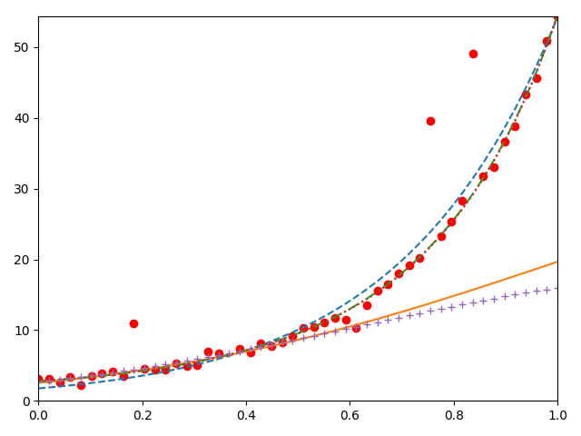
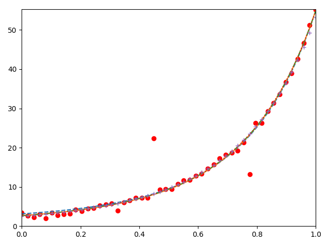

# LossTest

This is a simple loss function performance test for Huber, SoftLOne,Cauchy and Tukey in non-linear optimization.

This test is under a simple non-linear optimization work about 
fitting curve.

The target curve is $$ y = exp(ax^2 + bx +c) $$. The true a is 1., b is 2., c is 1.. Our target is find the a,b,c. We simple 50 points in $$x\in(0,1)$$, then add guassin noise for all points. After that, we random simple 10% points tag outlier and give then a noise in (-20, 20).

If we give a bad init [.95, 1.8, .8]. We can observe that the SoftLOneLoss and CauchyLoss is performance well. But the Huber and Tukey is performance bad.

```
trivialLoss opti result  [0.17379225] trivialLoss opti avager time  4.0
huber opti result  [1.88727019] huber opti avager time  4.0
SoftLOneLoss opti result  [0.0021365] SoftLOneLoss opti avager time  7.0
CauchyLoss opti result  [0.00604498] CauchyLoss opti avager time  7.0
tukeyloss opti result  [21.56013734] tukeyloss opti avager time  40.0
```



If we give a bad init [1., 2., 1.]. The Cauchy performance best.

```
trivialLoss opti result  [0.02682923] trivialLoss opti avager time  3.0  
huber opti result  [0.00030363] huber opti avager time  3.0  
SoftLOneLoss opti result  [0.00045687] SoftLOneLoss opti avager time  3.0  
CauchyLoss opti result  [4.7918312e-05] CauchyLoss opti avager time  5.0  
tukeyloss opti result  [0.00314354] tukeyloss opti avager time  8.0
```

